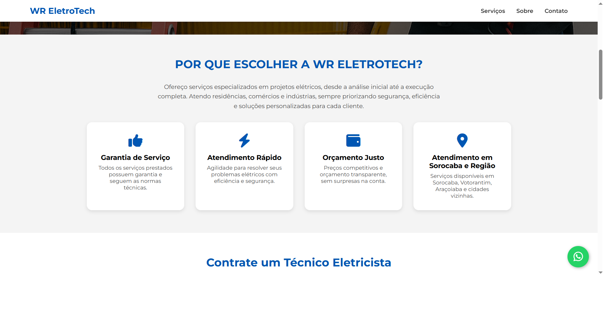
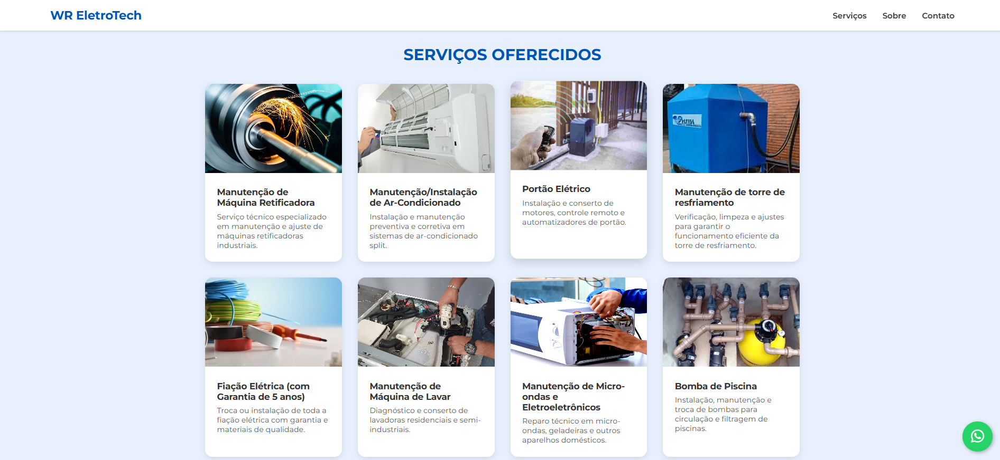

# ⚡ WR EletroTech — Soluções Elétricas Profissionais

Site institucional do eletricista WR EletroTech, oferecendo serviços elétricos para residências, comércios e indústrias em Sorocaba e região.

---

## 🚀 Tecnologias utilizadas

- [React.js](https://reactjs.org/)
- CSS puro (sem frameworks)
- Font Awesome (ícones)
- Vite (ambiente de build e desenvolvimento)

---

## 📷 Capturas de tela




---

## 💻 Rodando o projeto localmente

### Pré-requisitos

- Node.js e npm instalados

### Passos:

```bash
# Clone o repositório
git clone https://github.com/SEU_USUARIO/wr-eletrotech.git

# Acesse o diretório
cd wr-eletrotech

# Instale as dependências
npm install

# Rode o servidor de desenvolvimento
npm run dev
